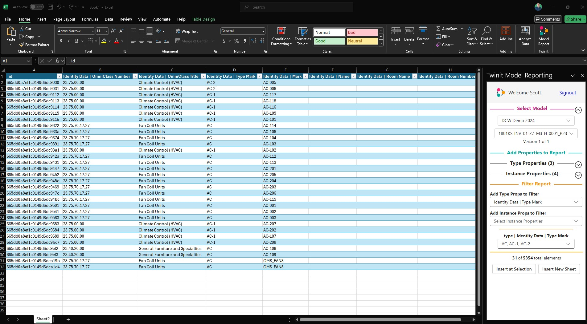

# digitaltwin-factory

[digitaltwin-factory](https://community.digitaltwin-factory.com/) is an open-source community powering development of digital twins on Twinit. Join the digitaltwin-factory community to gain access to a wealth of information and training material on how to use Twinit to accomplish your digital twin goals. Membership in digitaltwin-factory open-source community includes access to self-led development courses for building applications using Twinit, access to the developer documentation for Twinit concepts, services, and APIs, access to open-source code modules and UI libraries to help accelerate and kick-start your projects, as well as access to a community of developers who develop using Twinit. For more information visit [https://invicara.com/](https://invicara.com/) and [https://twinit.com/](https://twinit.com/.)

# Open-Source Code Modules, Examples, and Utilities

This repository contains open-source code modules, examples, and utilities for use with Twinit and made available as part of the digitaltwin-factory open-source community.

Each folder contains code that you can use or modify in your own projects, all available under the [Apache 2.0 License](./LICENSE).

Be sure to read the readme for each module for instructions on how to use it.

## Here is some of what you will find

### Example Viewer pageComponents for use with ipa-core

[Example pageComponent code](./pageComponents/simpleViewer/README.md) that clearly and simply shows how to use the Twinit IafViewer 3D/2D model viewer. Examples are available for selecting model elements in the viewer and connecting it to data in the item service, recording and setting camera views, and theming model elements.

### Twinit Excel Model Reporting Add-In

[Ready to build and deploy code](./utilities/ExcelModelReportingAddIn/README.md) for a Excel Add-In code enabling you to create imported Twinit model reports directly in Excel.

### Twninit Authentication Example from other clients

[Example code](./examples/twinit-auth-for-office/Readme.md) showing how to handle [Twinit's Oauth2 Authorization Code Grant](https://twinit.dev/docs/apis/rest/authentication/authcode-grant) from inside other applications like Office applications.