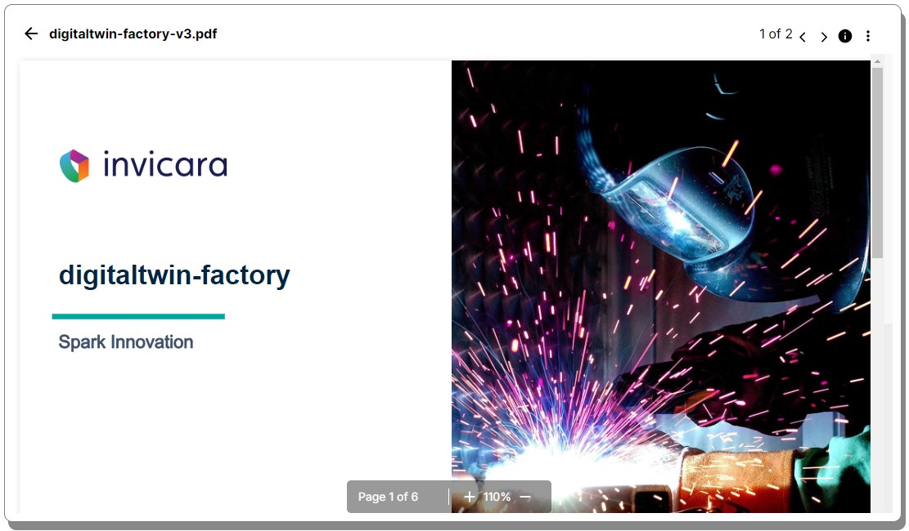

# FloatingDocViewer ipa-core React Component
version dtf-1.0



The FloatingDocViewer component provides an easy to implementation of the IafDocViewer in a floating, draggable, and resizable React control.

You are free to take the component and modify for your own purposes and, as with all digitaltwin-factory content, is available under the [Apache 2.0 License](../../LICENSE).

## Requirements

In order to use the FloatingDocViewer, your ipa-core application must be using ipa-core 3.0 or newer and the @dtplatform 4.3 or newer libraries.

If using the ```create-twinit-app``` npx command to scaffold a new client project for ipa-core, be sure to use the a ```create-twinit-app``` version of 3.0.6 or newer. You can check the version of create-twinit-app that created your current project by going into your project's package.json and finding the dev_twinit field.

* If you do not have a dev_twinit field in your package.json then your project was created using a version prior to 3.0.7.
* If you have a dev_twinit field, check the version number in the createdBy field. It will contain a version like: create-twinit-app@3.0.7.

## Adding FloatingDocViewer to Your Application

### Required npm Packages

The FloatingDocViewer component relies on the ```react-rnd``` library. To install the library run:

```npm install react-rnd```

### Using the FloatingDocViewer Component

An example implementation is available in the [FloatingDocViewer pageComponent](../../pageComponents/floatingDocViewer/README.md).

To use the component, copying it into your source and then import it into your page.

```JavaScript
import FloatingDocViewer from './components/FloatingDocViewer'
```

Then include the FloatingDocViewer in your render function.

```JavaScript
return <FloatingDocViewer
   docIds={fileIds}
   position={{x: 80, y:80}}
   size={{width: '1280px', height: '600px'}}
/>
```


### FloatingDocViewer properties

| Property     | Description  | Required  |
| --------     | -------      | -------   |
| __docIds__   |  The fileIds or fileIds and fileVersionIds of the fle in the File Service to display in the document viewer. See [IafDocViewer documentation](https://twinit.dev/docs/apis/doc-viewer/overview).   | Yes      |
| __position__ | An object containing the x and y default position of the floating viewer on the page | No <br> default { x: 80, y: 80 } |
| __size__     | An object containing the default width and height of the floating viewer on the page | No <br> default { width: '600px', height: '600px' } | 

