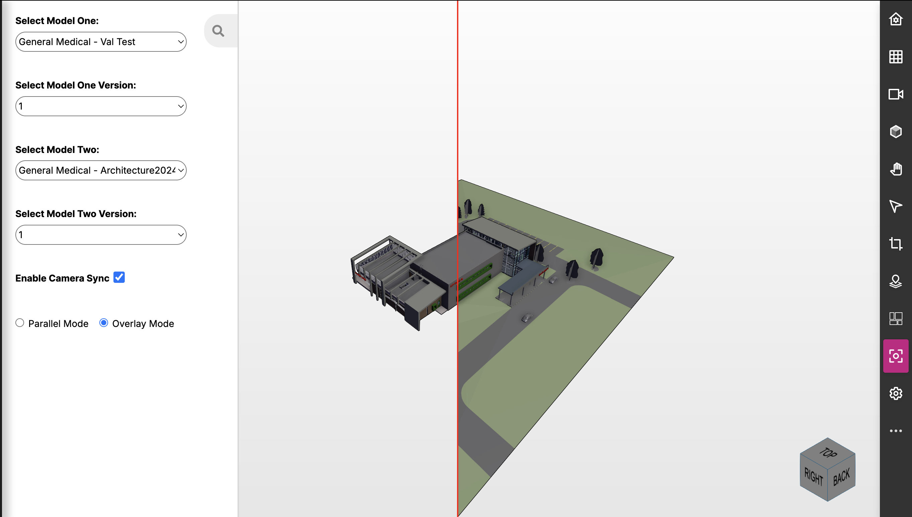

# SimpleViewerCompareView
version dtf-1.0



The SimpleViewerCompareView pageComponent provides an elegant and intuitive solution for comparing two 3D models side-by-side using Twinit's IafViewerDBM. This component enables you to select two imported models (and their specific versions) and view them simultaneously in either parallel or overlay mode. With synchronized camera controls, you can easily compare models with a seamless viewing experience.

The component features a clean, modern interface with a collapsible sidebar for model selection and settings, making it easy to switch between viewing modes and manage your comparison workflow.

You are free to take this pageComponent and modify it for your own purposes. As with all digitaltwin-factory content, it is available under the [Apache 2.0 License](../../LICENSE).

## Requirements

In order to use the SimpleViewerCompareView, your ipa-core application must be using ipa-core 3.0 or newer and the @dtplatform 5 or newer libraries.

If using the create-twinit-app npx command to scaffold a new client project for ipa-core, be sure to use a create-twinit-app version of 3.1.6 or newer. You can check the version of create-twinit-app that created your current project by going into your project's package.json and finding the dev_twinit field.

- If you do not have a dev_twinit field in your package.json, then your project was created using a version prior to 3.0.7.
- If you have a dev_twinit field, check the version number in the createdBy field. It will contain a version like: create-twinit-app@3.1.6.

In order to compare models, you must have at least two imported models available. You must also have created an import orchestrator, uploaded bimpks or sgpks, and used the import orchestrator to import the bmpk or sgpk contents into Twinit. The 'Self-Led Developer Training Intermediate' course on Twinit Academy has a lesson titled 'Importing and Managing Models' which walks you through all three of those steps.

If you have the import orchestrator already created and would like to be able to easily upload and import new versions of bmpks or new bimpks, consider implementing the SimpleModelImportView pageComponent. There is a sample bimpk provided there as well.

Plugins for supported CAD applications that can be used to upload bimpks of your own models can be downloaded from the Twinit plugins page.

### Required Dependencies

Make sure to install the following package:

```bash
npm install react-resizable-panels@2.1.7
```

## Adding SimpleViewerCompareView to Your Application

### Webpack and script updates to your application

If you used a version of create-twinit-app of 3.1.6 or newer, you can skip this step. Otherwise, follow the directions here for updating your webpack configuration and adding the viewer script tag.

### Adding the pageComponent

To add the pageComponent to your application:

1. Copy the `simpleViewerCompare` folder and its contents from this directory
2. Paste the folder into your `app/ipaCore/pageComponents` folder

## Configuring the SimpleViewerCompareView

Add the following to your handlers:

```json
"simpleViewerCompare": {
   "title": "Model Compare",
   "icon": "fa fa-clone fa-2x",
   "shortName": "simpleViewerCompare",
   "description": "Compare two 3D models side-by-side",
   "pageComponent": "simpleViewerCompare/SimpleViewerCompareView",
   "path": "/simpleViewerCompare",
   "config": {}
}
```

Add the page to your groupedPages so it shows up in the app navigation. An example is below:

```json
"model": {
   "icon": "fas fa-building fa-2x",
   "position": 1,
   "pages": [
      {
         "page": "Model Compare",
         "handler": "simpleViewerCompare"
      }
   ]
}
```

## Using the SimpleViewerCompareView

### Getting Started

The component features a collapsible sidebar (accessible via the search icon) that contains all model selection and viewing options. The sidebar can be toggled open or closed as needed, giving you full control over your viewing area.

### Selecting Models

1. Open the sidebar by clicking the search icon in the top-left corner.
2. Select the first model from the 'Select Model One' dropdown.
3. If the selected model has multiple versions, a 'Select Model One Version' dropdown will appear. Choose the version you want to compare.
4. Select the second model from the 'Select Model Two' dropdown.
5. If the selected model has multiple versions, a 'Select Model Two Version' dropdown will appear. Choose the version you want to compare.

Once both models and their versions are selected, the viewers will appear and begin loading the models automatically.

### Viewing Modes

The component supports two distinct viewing modes, each optimized for different comparison scenarios:

- **Parallel Mode**: Displays both models side-by-side with a visual divider between them. Each viewer operates independently, allowing you to navigate and inspect each model separately. This mode is ideal for comparing different aspects of models simultaneously.

- **Overlay Mode**: Displays both models in the same space with a draggable red divider. You can drag the divider horizontally to reveal more or less of either model, making it easy to compare specific areas or sections. The overlay mode uses a clip-path effect to create a smooth transition between the two models, perfect for detailed visual comparisons.

Toggle between modes using the radio buttons in the sidebar. The mode change takes effect immediately.

### Camera Synchronization

By default, camera synchronization is enabled, providing a seamless comparison experience. When you rotate, pan, or zoom in one viewer, the other viewer automatically matches the camera position with a smooth transition. This ensures both models are viewed from the same perspective, making it easier to spot differences and similarities.

You can disable this feature at any time by unchecking the "Enable Camera Sync" checkbox in the sidebar. When disabled, each viewer operates independently, giving you full control over individual camera positions.

## Component Structure

The SimpleViewerCompareView consists of the following components:

- **SimpleViewerCompareView.jsx**: Main component that orchestrates the two viewers, manages state, handles model selection, version management, and camera synchronization
- **CompareView.jsx**: Flexible component that handles both parallel and overlay viewing modes with support for horizontal and vertical orientations. Features a draggable divider in overlay mode for interactive model comparison
- **SimpleViewerCompareView.scss**: Stylesheet providing the layout and styling for the viewer wrapper, sidebar, and viewing controls

The component leverages `react-resizable-panels` for flexible panel management and `StackableDrawer` from ipa-core for the collapsible sidebar interface.

## Technical Details

### CompareView Component

The `CompareView` component is a reusable comparison container that supports:
- **Parallel mode**: Side-by-side layout with a fixed divider
- **Overlay mode**: Layered view with a draggable divider using CSS clip-path for smooth transitions
- **Orientation support**: Both horizontal and vertical orientations (currently configured for horizontal)
- **Interactive divider**: In overlay mode, the red divider can be dragged to adjust the visible portion of each model

## Notes

- The component requires at least two models to be available. If fewer than two models are available, the component will not render.
- Both models and their versions must be selected before the viewers will appear.
- Camera synchronization uses a 300ms delay to prevent excessive updates during rapid camera movements.
- The component automatically fetches available versions for each selected model.
- The sidebar can be collapsed to maximize viewing area when not needed.