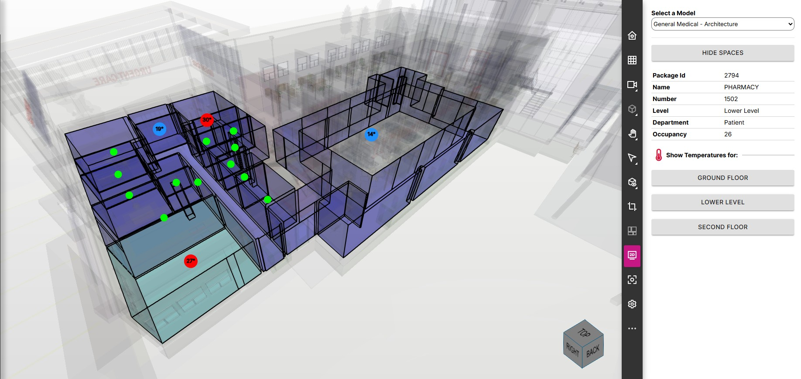

# Simple Viewer Markup View pageComponent



The SimpleViewerSpaceMarkupView pageComponent provides an easy to understand example to get started  programmatically drawing visual markups on the 3D view. The pageComponent allows you to:

* Select from your imported models and view them in the IafViewerDBM 
* Show and hide Spaces in the 3D/2D model and view their properties by selecting them
* Draw sample temperature reading markups on the spaces for a specified level

You are free to take the pageComponent and modify for your own purposes.

## Requirements

In order to use the SimpleViewerSpaceView, your ipa-core application must be using ipa-core 3.0 or newer and the @dtplatform 4.3 or newer libraries.

If using the ```create-twinit-app``` npx command to scaffold a new client project for ipa-core, be sure to use the a ```create-twinit-app``` version of 3.0.6 or newer. You can check the version of create-twinit-app that created your current project by going into your project's package.json and finding the dev_twinit field.

* If you do not have a dev_twinit field in your package.json then your project was created using a version prior to 3.0.7.
* If you have a dev_twinit field, check the version number in the createdBy field. It will contain a version like: create-twinit-app@3.0.7.

In order to view 3D/2D models you must also have created an import orchestrator, uploaded a bimpk or sgpk, and used the import orchestrator to import the bmpk or sgpk contents into Twinit. The 'Self-Led Developer Training Intermediate' course on Twinit Academy has a lesson titled 'Importing and Managing Models' which walks you through all three of those steps.

If you have the import orchestrator already created and would like easily upload and import new versions or new bimpks, consider implementing the [SimpleModelImportView pageComponent](https://github.com/Invicara/digitaltwin-factory/tree/master/pageComponents/modelImport).

Plugins for supported CAD applications that can be used to upload bimpks of your own models can downloaded from [the Twinit plugins page](https://apps.invicara.com/ipaplugins/).

> Note: Navisworks models are not supported by this sample pageComponent. See [About the Code](#about-the-code) below for more information on model support.

## Adding SimpleViewerSpaceMarkupView to Your Application

### Webpack and script updates to your application

If you used a version of create-twinit-app of 3.0.6 you can skip this step. Otherwise, follow the directions [here](https://twinit.dev/docs/apis/viewer/IafViewerDBM) for updating your webpack configuration and adding the viewer script tag.

### Adding the pageComponent

To add the pageComponent to your application:

1. Copy the ```SimpleViewerSpacesMarkup``` folder and its contents from this folder
2. Paste the folder in to your ```app/ipaCore/pageComponents``` folder

### Configuring the SimpleViewerSpaceMarkupView

Add the following to your handlers:

```json
"markupView": {
   "title": "Space Markup View",
   "icon": "fas fa-thermometer-half fa-2x",
   "shortName": "markupView",
   "description": "Space Markup View",
   "pageComponent": "SimpleViewerSpacesMarkup/SimpleViewerSpaceMarkupView",
   "path": "/spaceMarkupView",
   "config": {}
}
```

Add the page to your groupedPages so it shows up in the app navigation. An example is below:

```json
"model": {
   "icon": "fas fa-building fa-2x",
   "position": 1,
   "pages": [
      {
         "page": "Space Markup View",
         "handler": "markupView"
      }
   ]
}
```

## Using the SimpleViewerSpaceView

1. Select an imported model in the 'Select a Model' dropdown.

The viewer will then appear on the left of the page and begin loading the model in the viewer.

2. Once the model has loaded, click on the 'Show Spaces' button.

The view will update to show the spaces in the model.

3. Click on a space element to see some of its properties.

4. Click one of the Level buttons to hide all spaces except those on the selected level and to display mock temperature readings for each space. Spaces with temperature's between 20 and 26 degrees Celsius will display with a small green circle. Spaces with temperature's lower than 20 Celsius will display with a larger blue circle containing the temperature. Spaces with temperature's higher than 26 Celsius will display with a larger red circle containing the temperature.

## About the Code

### Revit Specific

While much of the code is generic for use with any model, some areas by necessity and for simplicity only support Revit models.

* Spaces are determined based on the "REVIT CATEGORY" property. Elements with the value "OST_ROOMS" for "REVIT CATEGORY" are considered to be spaces in this sample. See the ```getSpaces``` function in [SimpleViewerSpaceMarkupView.jsx](./SimpleViewerSpaceMarkupView.jsx) for where you can change the logic.
* Levels of the model are determined by the "Level" property on spaces.

Other modeling tools will manage levels and spaces differently.

### Temperature Readings

The temperature readings are randomly generated for each space each time the button for the level is clicked. In reality, you will most likely fetch the temperature readings from the Item Service using a TelemetryItem or from an API (potentially via an orchestrator in the Datasources Service).

### Markups

Markups are created by utilizing the viewerRef reference to the IafViewer.

The workflow to create a markup is:

1. Get the model element's node id

In order to place a markup on a model element you need to us the node id of the element in the graphics. The IafViewer maintains a mapping from the package_id (or source_id for some files) to node id. See the ```_getNodeFromPkgId``` function in [markupUtils.js](./markupComponents/markupUtils.js).

2. Get the point on the node to which to attach the markup

In this sample we attach the markup to the geometric center of the space. In this case we get the bounding box of the node and then use the center of the bounding box. This works in most cases, though you may see that you may have to pick other points if a space surrounds other spaces (like a U shaped hallway for instance). See the ```_getBoundingBoxCenter``` function in [markupUtils.js](./markupComponents/markupUtils.js).

3. Create your markup component

See ```_createCircleMarkup``` and ```_createTextMarkup``` in [markupUtils.js](./markupComponents/markupUtils.js) and the matching classes in [CircleMarkup.js](./markupComponents/CircleMarkup.js) and [TextMarkup.js](./markupComponents/TextMarkup.js).

4. Register your markup with the viewer

You can see this workflow in action in the ```createTempReadingMarkup``` function in [markupUtils.js](./markupComponents/markupUtils.js).

This example uses two markup shapes:

* circle
* text

For a complete list of supported markup shapes see [https://docs.techsoft3d.com/communicator/latest/api_ref/viewing/namespaces/Markup.Shapes.html](https://docs.techsoft3d.com/communicator/latest/api_ref/viewing/namespaces/Markup.Shapes.html).
