# Twinit Model Reporting Add-In for Excel

Twinit Model Reporting Add-In contains an example Twinit add-in for signing in to Twinit, selecting an imported 3D/2D model, and extracting the model data into tables in Excel. The Add-In allows you to query imported 3D/2D model element and property data and create tables in Excel based on the results of your queries, all from within Excel.

The Excel Twinit Model Reporting Add-In can be used wherever you use Excel; Windows, Mac, or even in the Browser.

This Add-in and any and all code, are provided as-is and without warranty or support, for educational purposes. You are free to use the code in your own projects.

# Table of Contents

1. [Prerequisites](#prerequisites)
2. [Building Office Add-Ins](#building-office-add-ins)
3. [Sideloading the Twinit Add-In](#sideloading-the-twinit-add-in)
4. [Deploying Office Add-Ins](#deploying-office-add-ins)
5. [Using the Add-In](#using-the-add-in)

## Prerequisites

Before starting you need to either have access to or be knowledgeable in the following:

* Have your Twinit application id (either for Twinit Sandbox or Twinit Production, though the example will assume Twinit Sandbox in most cases)
* Have Application Owner access to your application or are able to have an application owner make updates to your applications redirect URIs
* Have a user account on the same Twinit environment as your application
* Have setup your environment variables [as described here](https://twinit.dev/docs/apis/javascript/npm-install) so that you can use the included .npmrc file to install the Twinit @dtplatform API libraries

## Building Office Add-Ins

For more details on building add-ins for Office applications see [Microsoft's developer documentation](https://learn.microsoft.com/en-us/office/dev/add-ins/overview/learning-path-beginner).

To start a new Excel add-in from scratch follow the documentation [here](https://learn.microsoft.com/en-us/office/dev/add-ins/excel/excel-add-ins-overview).

## Sideloading the Twinit Add-In

The following steps will run the add-in in the desktop version of Excel. To run the sideload the add-in for Excel in the browser follow the steps [here](https://learn.microsoft.com/en-us/office/dev/add-ins/quickstarts/excel-quickstart-jquery?tabs=yeomangenerator#try-it-out)

In order to run the Twinit add-in you will need to make two configuration changes. The first will be update your Twinit application configuration to add an allowed redirect to the Twinit Add-In Signin page after the user has signed in to Twinit. The second will be to update the add-in code to include your application id. The steps to update both configurations are below.

### Update Your Twinit Application Config

You will need to have application owner access to follow these steps or to have an application owner follow them for you. These updates to your application's redirect URIs will allow Twinit to redirect a signed in user back to the Excel add-in.

1. Sign in to the Twinit Console Application
   * [Twinit Sandbox Console](https://sandbox.invicara.com/console)
   * [Twinit Production Console](https://apps.invicara.com/console)
2. Select your application from the dropdown list
3. Select the 'Application Details' page from the navigation bar on the left
4. In the Settings > Redirect URIs section add a new entry for ```https://localhost:3000/signin.html```
5. Click the Save Settings button

### Update the Twinit Config

These changes will add your application to the add-in allowing users to select it to sign in to.

1. Clone this code locally
2. Rename ```src/taskpane/TwinitConfig_template.js``` to ```src/taskpane/TwinitConfig.js```
3. Open ```TwinitConfig.js``` and replace the item in the applications array with your application name and application id
4. Save the file

### Run the Twinit Add-In Locally

> __@dtplatform libraries__  
If you have not already, be sure that you have [created the DTPLATFORM environment variables as described here](https://twinit.dev/docs/apis/javascript/npm-install) so that the .npmrc file included in this project will be able to install the correct @dtplatform libraries in order for the add-in to communicate with Twinit.

1. run ```npm install```
2. run ```npm start```

## Deploying Office Add-Ins

There are a few different ways to publish and deploy an Office Add-In for your users. Please reference the [Microsoft Documentation for Deploy and publish Office Add-ins](https://learn.microsoft.com/en-us/office/dev/add-ins/publish/publish) for more information how you can deploy the Add-In.

## Using the Add-In

### Signing in to Twinit

1. When the Twinit Add-In loads, select the environment for your application, and then select your application. Click Signin.


2. A new dialog will open allowing you to sign in to Twinit.


3. Signin as you usually would to Twinit.

Once signin is complete, the dialog will disappear and you will see the add-in user interface updates to display your user's first name in the header.

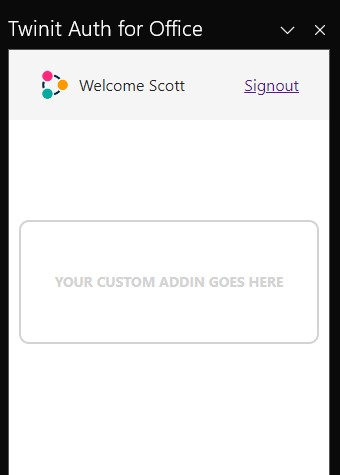

#### Using other Application IDs

If you need to sign in to a different application other than Assure or Digital Twin:

1. On the signin page of the add-in click the ‘Don't see your application? Click here’ link.

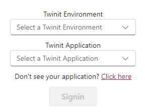

2. The page will update to allow you to input any application id. Your app must be configured to allow the excel add-in to connect to it.

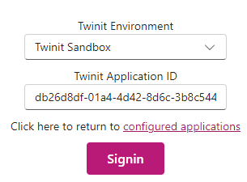

### Selecting a Model

1. Select the Workspace or Project that contains your model.
2. Then select the model you wish to report on. Only the latest version of the model is currently supported.

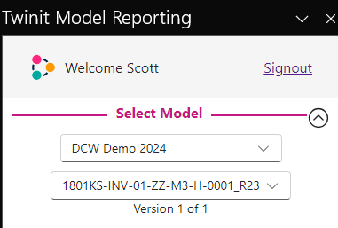

Next the Add-In will load all the properties from your model. For large files this may take some time.

### Add Properties to the Report

Once the properties are loaded you can select what properties you want to appear int he report table. By default the Twinit _id property will always be included and you do not need to select it.

1. Select the Type and Instance properties you want to see in the report (or that you will want to use to filter your report ). Properties are grouped by their property sets if the source model has them.

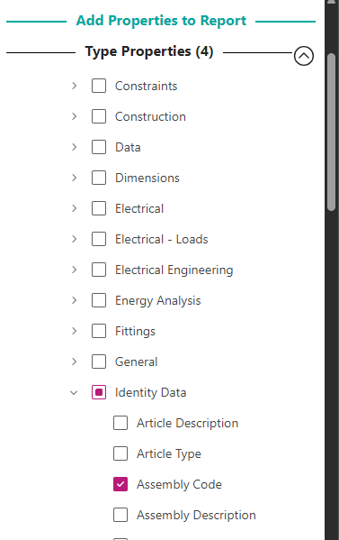

2. The tree labels will update the number of properties you have selected.

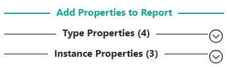

### Filter the Model Elements for the Report

Once you have added a property to the report, you can also use that property to filter the elements that you will see in the report. The count of elements at the bottom of the Filter Report section will update to display the total number of elements in the model and the number of elements which will be in the report table based on your filters.

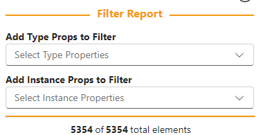

To filter elements in your report:

1. Select one of your selected properties from a filter report dropdown.

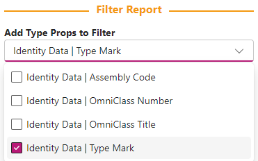

2. A new control will display allowing you to filter based on the property values.

For text, you can choose one or more values for that property in the model.

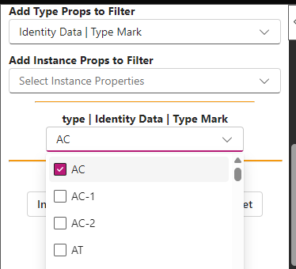

For number, you can choose to filter on a value equal to, greater than a value, less than a value, between two values, or outside two values.

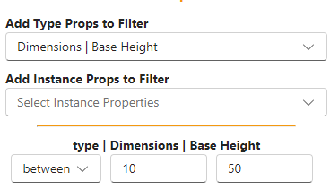

3. After setting filters the count of returned elements will update.

### Insert Report Tables

Once you have selected the model to report on, selected the properties you wish to appear in the report, and filtered down to the elements you want to report on, you can insert a table into Excel.

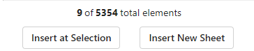

#### Insert New Sheet

1. Click the Insert New Sheet button

A new sheet will be created and the table contain your report data will inserted starting at cell A1. Filter and sort controls will be added and the columns will be resized automatically.

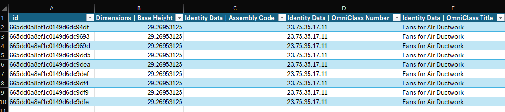

#### Insert at Selection

1. Click the Insert at selection button

A new table will inserted into the currently selected sheet at the currently selected cell. In this way you can insert multiple tables into a single sheet.

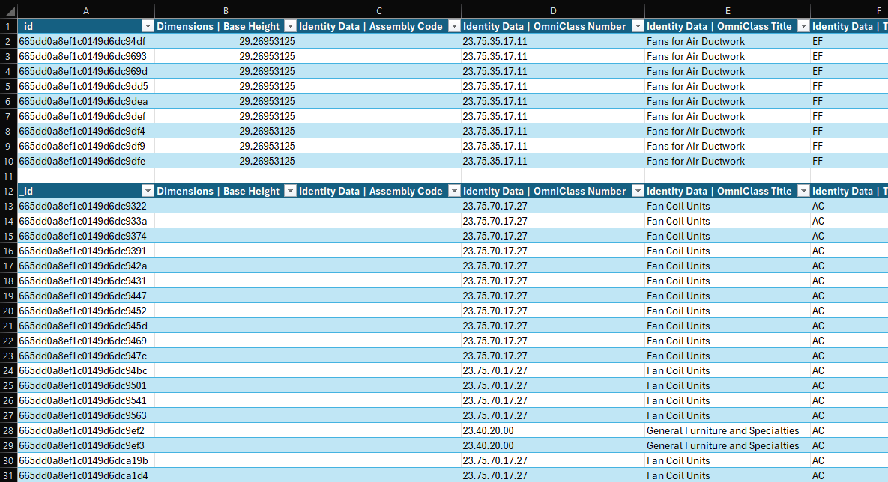